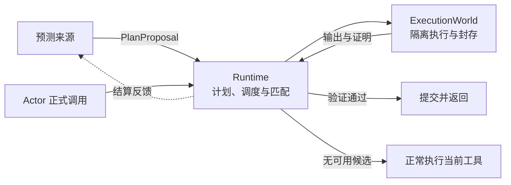

# Pi 投机执行

一个无需修改 Pi 的工具投机执行扩展：在 Actor（执行当前任务的模型）发出正式工具调用前，预测后续动作并提前执行；调用到达后，验证并采纳已有计算。项目围绕三个部分组织：预测计划、统一 Runtime、隔离执行后端。

## 工作流程



预测来源统一生成带依赖关系的 `PlanProposal`，可随执行结果继续扩展。Runtime 按 Actor 决策进度推进计划，根据依赖、启动窗口和实时资源安排准备与执行。同一 Runtime 的各会话共用调度器，准备、投机执行与真实调用共用资源账本，Actor 优先。

正式调用通过动作键和投影规则查找候选：可以采用完整或覆盖当前请求的结果，也可以在封存的不可变输入上按当前参数重新求值。已绑定动作的准备工作、排队候选和在途执行均可交给 Actor 继续推进，直至完成或接续其进程；取消、执行失败和输入失效按生命周期处理。

匹配只负责找到候选；采纳还必须证明执行器兼容、权限与作用域有效、实际依赖未变。提交前无法证明可用时按当前绑定正常执行；部分或不确定的提交失败终止本次调用，避免重复副作用。

## 代码模块

| 模块 | 主要源码 | 职责 |
| --- | --- | --- |
| Pi 接入 | [extension.ts](./src/extension.ts)、[agent-integration.ts](./src/agent-integration.ts) | 注册扩展与设置菜单，接收模型流和工具调用，连接 Host、Runtime 与执行后端。 |
| 预测来源 | [drafter-plan-source.ts](./src/drafter-plan-source.ts)、[pattern-plan-source.ts](./src/pattern-plan-source.ts)、[actor-fork-plan-source.ts](./src/actor-fork-plan-source.ts) | 将模型预测、历史模式和可选 Actor 探测转换为统一计划，供 Runtime 调度和反馈。 |
| 计划与调度 | [plan-runtime.ts](./src/plan-runtime.ts)、[scheduler.ts](./src/scheduler.ts)、[system-resources.ts](./src/system-resources.ts) | 推进依赖与预测窗口，依据实时资源、调用需求和置信度安排工作，处理争用与抢占。 |
| 候选与采纳 | [runtime-engine.ts](./src/runtime-engine.ts)、[action-semantics.ts](./src/action-semantics.ts)、[candidate-stores.ts](./src/candidate-stores.ts) | 管理会话、动作身份、候选索引、结果和输入借用；完成匹配、等待、验证与结算。 |
| 执行协议 | [execution-world.ts](./src/execution-world.ts)、[effect-transaction.ts](./src/effect-transaction.ts)、[runtime-lifecycle.ts](./src/runtime-lifecycle.ts) | 统一后端能力、分支提交状态，以及在途任务和资源的关闭排空。 |
| 度量 | [settlement.ts](./src/settlement.ts)、[task-timing.ts](./src/task-timing.ts)、[trace-summary.ts](./src/trace-summary.ts) | 区分预测、执行与实际采纳，按计算来源汇总复用量、工具等待和诊断事件。 |

根入口导出 [Pi Host API](./src/index.ts)；[`./core`](./src/core.ts) 提供不依赖 Pi 的 Runtime，[`./process-reuse`](./src/process-reuse.ts) 提供进程证明、规划和存储接口。新增预测来源实现 `SpeculativePlanSource`；新增后端实现 `ExecutionWorld`，通过 Host 的 `executionWorlds` 注册。宿主负责在结束时调用 `host.dispose()`。

## 执行方案

各后端遵循同一协议：`ExecutionWorld` 提供执行或观察能力，一次执行返回 `WorldBranch`，封装输出、依赖证明、可提交效果和资源释放方法；`EffectTransaction` 管理验证与采纳状态。后端可额外提供封存输入与查询能力，使不同工具或参数复用已有输入计算。只有通过能力检查的路线才允许提前执行。

| 实现 | 方法与边界 |
| --- | --- |
| [封存资源](./src/agent-execution-world.ts) / [输入版本](./src/resource-version.ts) | 为绑定的文件工具捕获实际访问的数据，保留内容与路径证明；后续查询复用仍有效的输入，并对本次使用的依赖精确验新。受控 `find/grep` 由 [统一工具绑定](./src/pi-tool-invocation.ts) 让 Actor 与投机使用相同执行器，需显式启用。 |
| [私有工作区](./src/workspace-sandbox.ts) / [文件事务](./src/workspace-transaction.ts) | 普通 `write/edit` 先在内存事务中执行；需要私有分支时使用 Git 或通过检查的 OverlayFS。文件效果在持锁状态下验证并提交，多步计划可沿私有分支继续执行。 |
| [Linux 进程](./src/linux-process-world.ts) / [进程后端](./src/linux-process-backend.ts) | 用 Sandlock 隔离执行、strace 记录依赖和效果，再通过证书验证。合格的 x86-64 Linux 使用 [held-exec](./src/linux-held-exec.c) 接管已完成计算，或在支持的系统调用入口转移单线程进程、继续执行后缀。可证明等价的结果在输入不变且生命周期有效时反复复用；含时钟、随机或进程身份等观测的结果只转交一次。 |
| [ThinkThread](./src/thinkthread/execution-world.ts) | 通过固定 SDK 的快照与 `fs.run` 接入相同分支协议，文件读取可进入公共封存输入层。默认覆盖 `read/ls/write/edit`；原生 `bash/find/grep` 回到 Actor，不嵌套 Linux 进程后端。 |

结果、输入和进程句柄分别保留自己的所有权；跨轮复用仍需作用域与新鲜度证明。结果按容量统一回收，预测结束或计算年龄不会单独撤销接管机会；后台回收保护已进入接管流程的工作，取消和关闭按生命周期排空资源。文件监听与缓存索引只辅助定位和失效处理，不能代替采纳证明。

## 使用

```sh
pi install https://github.com/xchang1121/pi-speculative-action
# 或加载本地 checkout
pi -e /absolute/path/to/pi-speculative-action
```

版本与依赖见 [package.json](./package.json)。在 Pi 中运行 `/speculative-action`，开启投机、选择预测来源和工具后 **Apply changes**；在 **Tools & execution → Execution routes** 检查实际可用的后端。配置保存在 `<agent-dir>/speculative-action.json`，项目的 `.pi/speculative-action.json` 可覆盖全局设置。

Linux / WSL 2 的 Bash 后端可从菜单检查和安装，也可在源码目录运行 `npm run setup:linux`；WSL checkout 应放在 Linux 原生文件系统。原生进程自动选用合格的 OverlayFS，回退 Git 时补齐空目录和权限；两条路径中被复制的原始对象通过持有对象和元数据映射，保持路径、文件描述符及目录枚举所见身份一致，采纳前仍精确验新。ThinkThread 使用独立的 [Profile 安装脚本](./scripts/install-thinkthread-profile.sh)，安装后在项目中运行 `tt pi-speculative-action`。后端不可用时保留正常 Actor 执行。

## 开发与验证

```sh
npm ci
npm run check
npm run build
npm test -- --maxWorkers=1 --no-file-parallelism
npm run bench:check
```

[test](./test) 覆盖匹配、隔离、效果提交与清理；[验证说明](./bench/README.md) 提供真实后端资格、搜索路径、完整模型任务和计量规则。`toolSpeedup = T / (T - H)` 采用乐观执行边界口径：T 为本次调用实际消费的执行区间，含首次证明、封存及生产者在调用后继续完成的计算；H 为其中实际复用且在 Actor 发出调用前完成的部分。接管控制区间从 Actor 执行中排除，`adoptionWaitMs` 单列未被计算覆盖的协调等待。该比值不代表 CPU 加速或任务端到端净收益。
